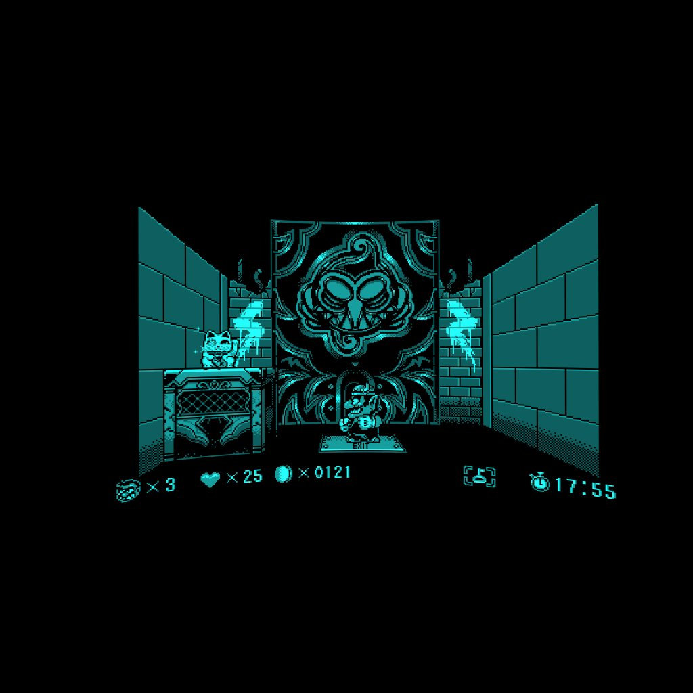
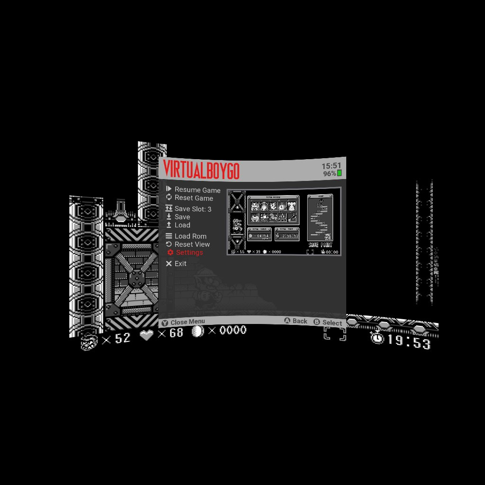
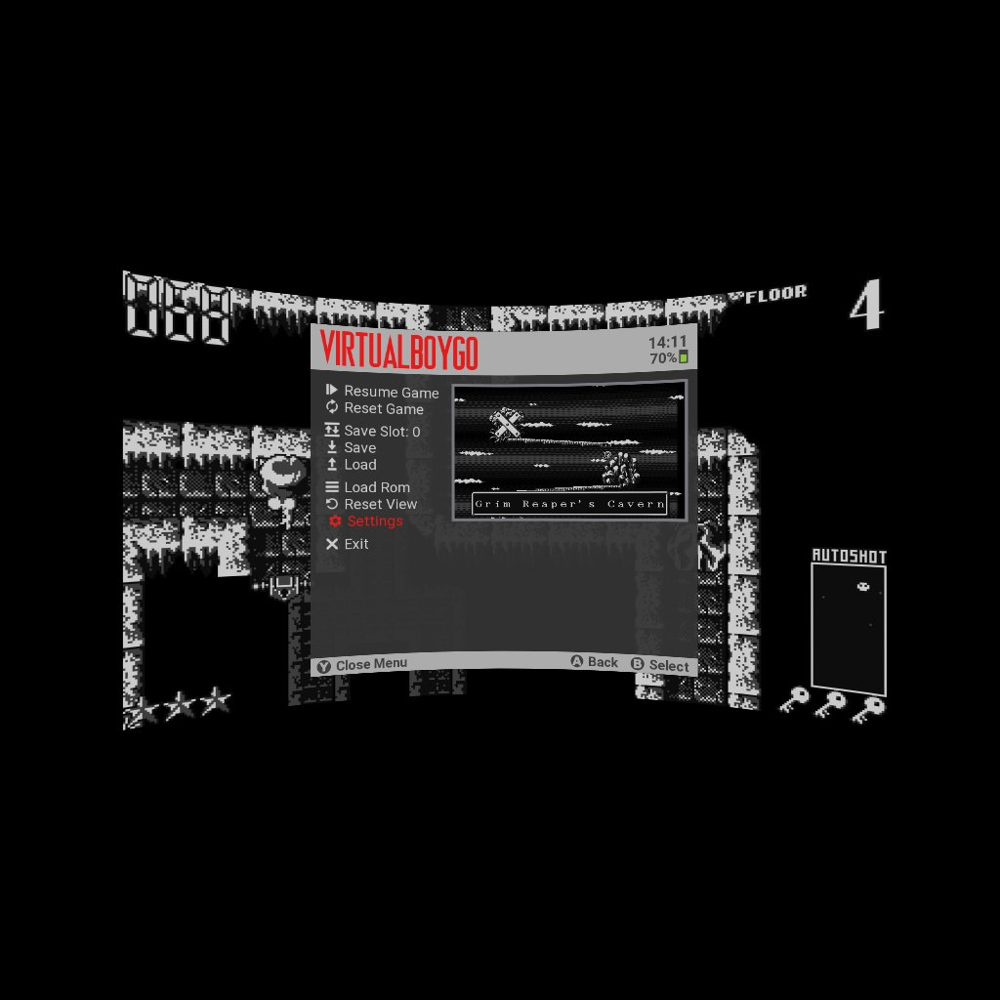
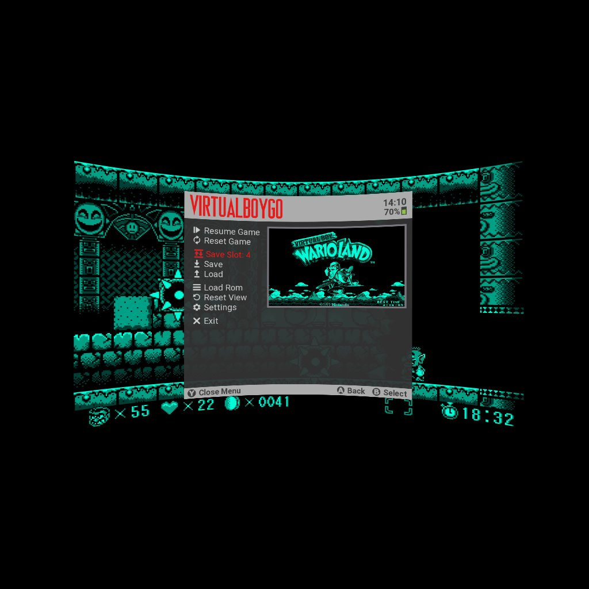
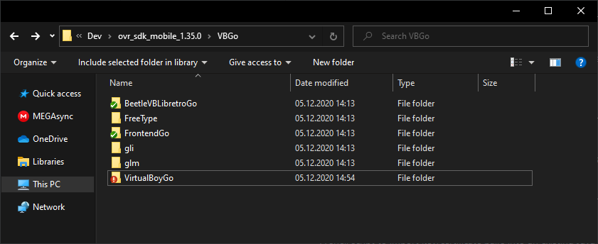

# VirtualBoyGo
A Virtual Boy emulator for the Oculus Go and Oculus Quest 1+2 based on the Mednafen Virtual Boy emulator.

The emulator can be downloaded from SideQuest: https://sidequestvr.com/app/125/virtualboygo

The font used in the emulator header is from https://www.planetvb.com/modules/newbb/viewtopic.php?post_id=10801#forumpost10801

| 	| 	|
| --------------------- | --------------------- |
| 	| 	|

## Compiling

- download the "Oculus Mobile SDK 1.35.0" https://developer.oculus.com/downloads/package/oculus-mobile-sdk/1.35.0/

- create a folder named VBGo inside the "ovr_sdk_mobile_1.35.0" folder

- clone this repo into the VBGo folder

- clone https://github.com/CidVonHighwind/FrontendGo into the VBGo folder

- clone https://github.com/CidVonHighwind/BeetleVBLibretroGo into the VBGo folder

- open "ovr_sdk_mobile_1.35.0/cflags.mk"

  - remove or comment out "LOCAL_CFLAGS	+= -Werror" and "LOCAL_CFLAGS	+= -Wshadow"

  - add this at the end of the file:

    LOCAL_CFLAGS += -Wno-sign-compare
    
    LOCAL_CFLAGS += -Wno-format
    
    LOCAL_CFLAGS += -Wno-unused-variable
    
    LOCAL_CFLAGS += -Wno-unused-function
    
    LOCAL_CFLAGS += -Wno-ignored-qualifiers
    
    LOCAL_CFLAGS += -Wno-sign-compare
    
    LOCAL_CFLAGS += -Wno-dangling-else
    
    LOCAL_CFLAGS += -Wno-deprecated-declarations
    
    LOCAL_CFLAGS += -frtti

- download "FreeType 2.10.0" https://download.savannah.gnu.org/releases/freetype/ and copy the "include" and the "src" folder into the newly created "ovr_sdk_mobile_1.35.0/VBGo/FreeType/" folder
- Copy "Android.mk" and "Application.mk" from the "FrontendGo/freetype mk" into "ovr_sdk_mobile_1.35.0/VBGo/FreeType/"

- download "gli 0.8.2.0" https://github.com/g-truc/gli/releases and copy the gli folder (the one next to doc, test, util, etc.) into "ovr_sdk_mobile_1.35.0/VBGo/"

- download "glm 0.9.8.0" https://github.com/g-truc/glm/releases/tag/0.9.8.0 and copy the glm folder (the one next to doc, test, util, etc.) into "ovr_sdk_mobile_1.35.0/VBGo/"

- the VBGo folder should now look like this:
 

- in Android Studio open ovr_sdk_mobile_1.35.0/VirtualBoyGo/Projects/Android
