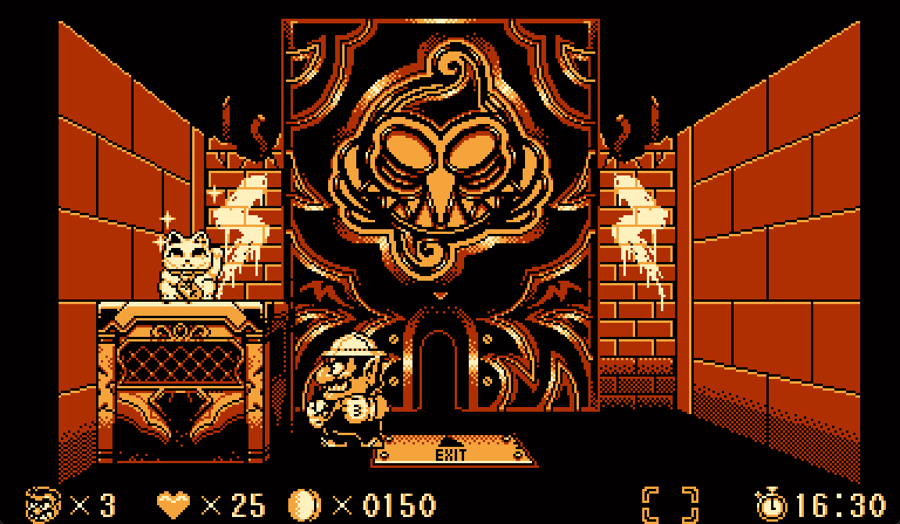
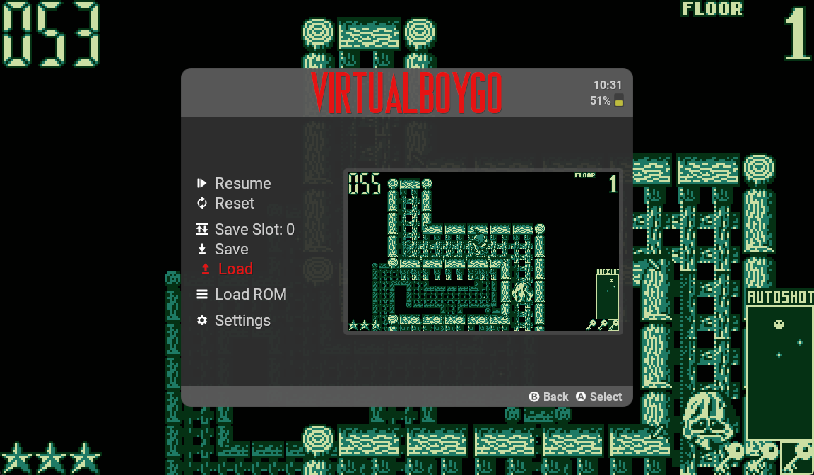
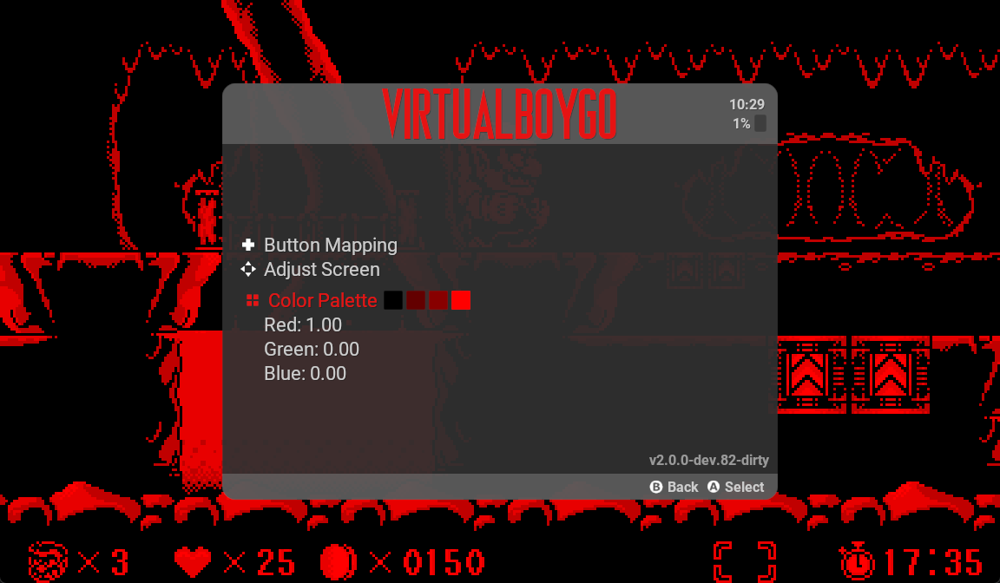
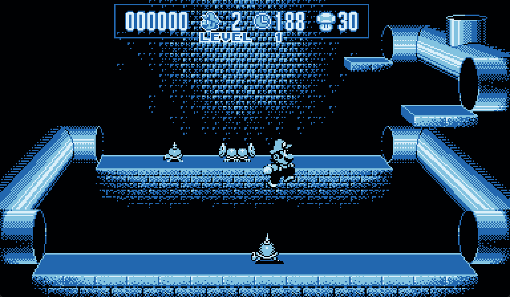

# VirtualBoyGo

VirtualBoyGo is a Virtual Boy emulator for VR headsets, built on **OpenXR +
Vulkan** as a single app sharing one Vulkan rendering codebase. This is a
from-scratch rework of the original VirtualBoyGo.

Currently supported: **Quest** (Android), **Desktop VR** (PC, streamed to a
headset via Virtual Desktop/SteamVR/Link), and **Desktop 2D** (PC, no headset
needed, for fast local iteration). Other Android VR headsets (Frame, etc.)
are planned for the future.

|   |   |
|---|---|
|  |  |
|  |  |

## Features

- In-VR menu for ROM selection, settings, and button mapping
- Save states (multiple slots, with preview thumbnails)
- Adjustable screen placement/size in the VR view
- Configurable VB screen color palette, including a custom R/G/B tint

## Opening the menu

| Device | Button |
|---|---|
| VR controllers | **Left stick click**, or the left controller's **Menu** button |
| Gamepad (Quest) | **Left stick click**, or the **Xbox/Guide** button |
| Desktop 2D build | **Tab** |

Left stick click always works. The physical menu button depends on the
runtime - SteamVR, for instance, keeps it for its own dashboard and never
passes it to the app.

## Project layout

```
CMakeLists.txt              root build - FetchContent for volk, Vulkan-Headers,
                             OpenXR-SDK (loader), glslang (shader compiler)
core/                        shared, platform-agnostic app code
  OpenXrApp.cpp/.h           instance/system/session/swapchain/event loop
  VulkanRenderer.cpp/.h      Vulkan device/pipelines/rendering
  XrMath.h                   small self-contained matrix math
  io/Platform.h              platform interface (asset/ROM/settings I/O, battery),
                             implemented per-platform under platform/
  third_party/stb_image.h    vendored image decoder (JPEG/PNG)
  generated_shaders/         SPIR-V headers, produced by the PC build's
                             shader compiler and committed (Android's
                             cross-compile can't build/run glslang itself)
platform/                    per-platform entry points only, call into core/
  pc/Main.cpp                desktop entry point (OpenXR, streamed to headset)
  pc2d/Main.cpp               flat GLFW window entry point (no headset needed)
  android/AndroidMain.cpp    NativeActivity entry point
shaders/                     GLSL sources (compiled to SPIR-V at PC build time)
assets/                      shared between PC and Android (Gradle assets dir)
tools/ShaderCompiler.cpp     glslang-based GLSL -> SPIR-V compiler, PC-only build tool
android/                     Gradle wrapper project (externalNativeBuild -> root CMakeLists.txt)
```

## Building - PC

No Vulkan SDK required (Vulkan is loaded dynamically via `volk`; shaders are
compiled via glslang's C++ API, fetched and built as part of this project).

```
cmake -B build-pc -G "Visual Studio 18 2026" -A x64 -DCMAKE_POLICY_VERSION_MINIMUM=3.5
cmake --build build-pc --config Debug
build-pc\Debug\VirtualBoyGoPC.exe
```

Requires an OpenXR runtime already registered and a headset actively
connected (Virtual Desktop, SteamVR, or Oculus Link) - it streams straight to
the headset with no APK/adb involved. `XR_ERROR_FORM_FACTOR_UNAVAILABLE`
means the headset isn't currently connected, not a code bug.

### Version string

The Settings page's version label is auto-generated at build time (see
`cmake/GenerateVersion.cmake`) - by default `v<VBGO_VERSION>-dev.<commit
count>` (e.g. `v2.0.0-dev.81`, `-dirty` appended if the working tree has
uncommitted changes). This is deliberately independent of `--config
Debug`/`Release` - an optimized Release build is still just a local dev/perf-
test build unless you explicitly say otherwise. Only pass this for the build
you're actually cutting as a numbered release:

```
cmake -B build-pc -G "Visual Studio 18 2026" -A x64 -DCMAKE_POLICY_VERSION_MINIMUM=3.5 -DVBGO_RELEASE_BUILD=ON
cmake --build build-pc --config Release
```

which produces the clean `v<VBGO_VERSION>` string instead. Bump `VBGO_VERSION`
in the root `CMakeLists.txt` by hand at each release.

## Building - Android (Quest)

Requires Android SDK (compileSdk 34, build-tools 34.0.0) + NDK 23.2.8568313 +
CMake 3.22.1 (e.g. via `sdkmanager`).

### Setup

Set your SDK path in `android/local.properties` (forward slashes, even on Windows):

```
sdk.dir=C\:/Users/<you>/AppData/Local/Android/Sdk
```

Or set the `ANDROID_HOME` environment variable instead.

For **release** builds only, point at the signing keystore folder (kept
outside the repo) in the same `android/local.properties`:

```
keystore.dir=D\:/Development/VR/VirtualBoyGo Key
```

The folder must contain `android.keystore` and a `keystore.txt` (line 1 =
store password, line 2 = key password). Debug builds don't need this.

Gradle (`./gradlew`) also needs a JDK, separate from the Android SDK/NDK
above - if you get an error like "JAVA_HOME is not set" or "java: command not
found", set `JAVA_HOME` before invoking gradlew. Android Studio already
bundles a JDK, so if it's installed, point at that instead of installing one
separately:

```
# PowerShell, one-time for the session:
$env:JAVA_HOME = "C:\Program Files\Android\Android Studio\jbr"

# or inline per command:
JAVA_HOME="C:\Program Files\Android\Android Studio\jbr" ./gradlew assembleRelease
```

(Adjust the path if Android Studio is installed elsewhere, or use any other
JDK 17+ install's home directory.)

### Build & install (USB)

```
cd android
./gradlew assembleDebug
adb install -r app/build/outputs/apk/debug/app-debug.apk
```

Or `assembleRelease` / `app/build/outputs/apk/release/app-release.apk` - an
optimized build for testing on-device (fast enough to actually play), but
still just a dev build (`v2.0.0-dev.<commit count>` in Settings) unless you
add `-Pofficial=true`:

```
./gradlew assembleRelease -Pofficial=true
```

which is what actually cutting a numbered release should use - see
"Version string" above for why this is a separate flag from the Debug/Release
build type.

### Run

```
adb shell am start -n com.nintendont.virtualboygo/android.app.NativeActivity
```

### Wi-Fi ADB (wireless debugging)

One-time: on the headset, **Settings → Developer → Wireless debugging → Pair
device with pairing code**, then `adb pair <ip>:<pairing-port>`.

Each session: `adb connect <headset-ip>:5555`, then use the same
`adb install`/`adb shell am start` commands above. Reconnect (`adb connect`
again) if it drops when the headset sleeps; `adb disconnect` to go back to
USB.

If you change a shader (`shaders/*.vert|frag`), rebuild the **PC** target
first to refresh the committed headers in `core/generated_shaders/`
before building Android - the Android cross-compile doesn't build the shader
compiler itself.

## Building - PC, 2D debug (no headset)

Same CMake project - configuring the PC build (above) also produces this
target. No OpenXR runtime or headset required at all:

```
build-pc\Debug\VirtualBoyGoPC2D.exe
```
